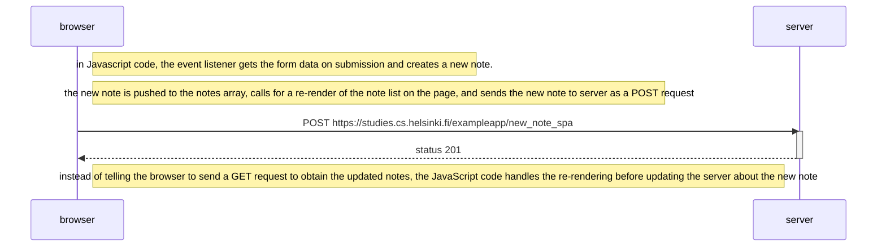

```mermaid
sequenceDiagram
    participant browser
    participant server

    Note right of browser: in Javascript code, the event listener gets the form data on submission and creates a new note.
    Note right of browser: the new note is pushed to the notes array, calls for a re-render of the note list on the page, and sends the new note to server as a POST request

    browser->>server: POST https://studies.cs.helsinki.fi/exampleapp/new_note_spa
    activate server
    server-->>browser: status 201
    deactivate server

    Note right of browser: instead of telling the browser to send a GET request to obtain the updated notes, the JavaScript code handles the re-rendering before updating the server about the new note
```
